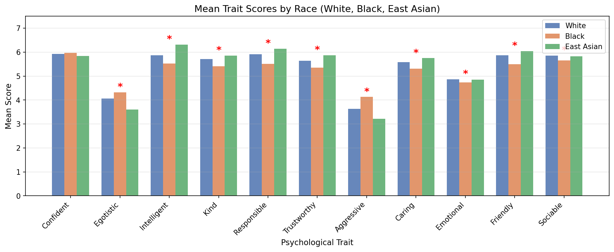
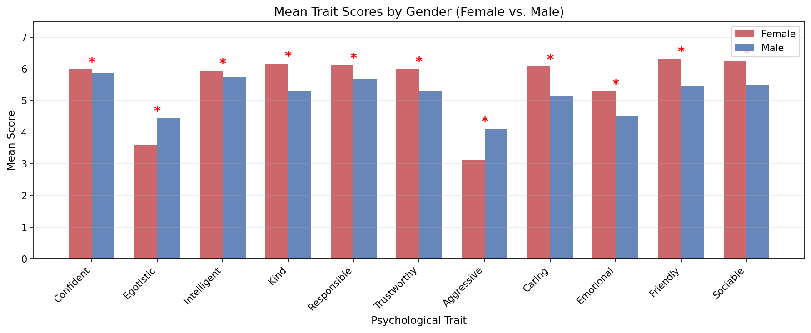
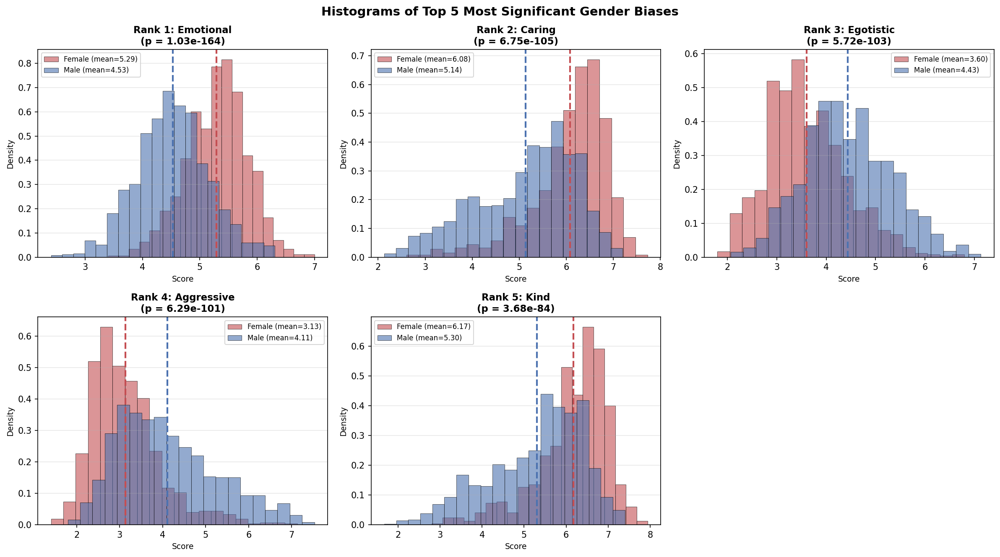
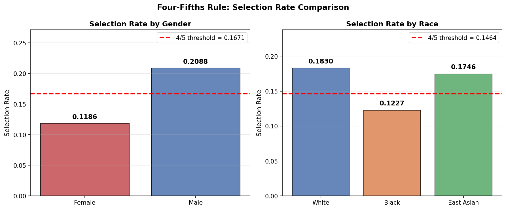

# Fairness and Bias Analysis in Machine Learning

## Overview
This project analyzes bias in machine learning systems using the **10k US Adult Faces Dataset**, focusing on how demographic attributes such as **race and gender** influence perceived personality traits and downstream classification outcomes.

The goal is to identify and quantify **algorithmic bias** using statistical methods and fairness metrics, highlighting the ethical implications of deploying machine learning models in real-world decision-making systems.

---

## Objectives
- Evaluate **racial and gender bias** in annotated personality trait data  
- Apply statistical hypothesis testing to identify significant disparities  
- Analyze how bias propagates into **classification outcomes**  
- Measure fairness using the **four-fifths rule**  
- Provide insights into **ethical risks in AI systems**  

---

## Methods

### 1. One-Way ANOVA (Race-Based Bias)
- Compared trait ratings across **White, Black, and East Asian groups**  
- Found statistically significant differences in **10 out of 11 traits**

**Key findings:**
- East Asian individuals rated highest in *Intelligent* and *Responsible*  
- Black individuals rated higher in *Aggressive* and lower in positive traits  

  

<em>Figure 1: Mean trait scores by race</em>

---

### 2. Independent Samples t-Test (Gender-Based Bias)
- Compared trait ratings between **Male and Female groups**  
- All **11 traits showed statistically significant differences (p < 0.001)**  

**Key patterns:**
- Females rated higher in: Kind, Trustworthy, Caring, Emotional, Friendly, Sociable  
- Males rated higher in: Aggressive, Egotistic  

  

<em>Figure 2: Mean trait scores by gender</em>

---

### 3. Bias Ranking
- Ranked all 22 bias tests (11 traits × 2 demographics) by significance  
- **Top 5 biases were all gender-related**

**Most significant bias:**
- Emotional trait showed the strongest disparity between groups  

---

### 4. Distribution Analysis
- Plotted histograms for top 5 biases  
- Observed clear **distributional separation between groups**

**Examples:**
- Female distributions shifted higher for Emotional and Caring  
- Male distributions shifted higher for Aggressive  

  

<em>Figure 3: Histograms of top 5 most significant gender biases</em>

---

### 5. Fairness Evaluation (Four-Fifths Rule)

Applied fairness metric to classification outcomes:

**Gender Bias**
- Female selection rate: 11.86%  
- Male selection rate: 20.88%  
- Ratio: **56.78% → Adverse impact detected**

**Racial Bias**
- Black-to-White ratio: **67.06% → Adverse impact detected**  
- East Asian-to-White ratio: 95.41% → No adverse impact  

  

<em>Figure 4: Selection rate comparison using the four-fifths rule</em>

---

## Key Findings
- Significant **gender bias across all traits**  
- Notable **racial bias in most traits**  
- Bias in perception translates into **biased classification outcomes**  
- Machine learning systems can reinforce **societal stereotypes**

---

## Ethical Implications
This project demonstrates that:
- Bias in data leads to **biased model behavior**  
- ML systems used in hiring or evaluation can produce **discriminatory outcomes**  
- Fairness auditing is critical in **high-stakes applications**  

---

## Technologies Used
- Python  
- NumPy / Pandas  
- SciPy (ANOVA, t-tests)  
- Matplotlib / Seaborn  
- Jupyter Notebook  

---

## Future Work
- Apply bias mitigation techniques:
  - Reweighting  
  - Adversarial debiasing  
  - Post-processing calibration  
- Evaluate fairness across additional demographic attributes  
- Test impact on real-world ML pipelines  

---

## Author
Kevin Kim  
M.S. Candidate, Computer Science – Artificial Intelligence  
USC Viterbi School of Engineering
